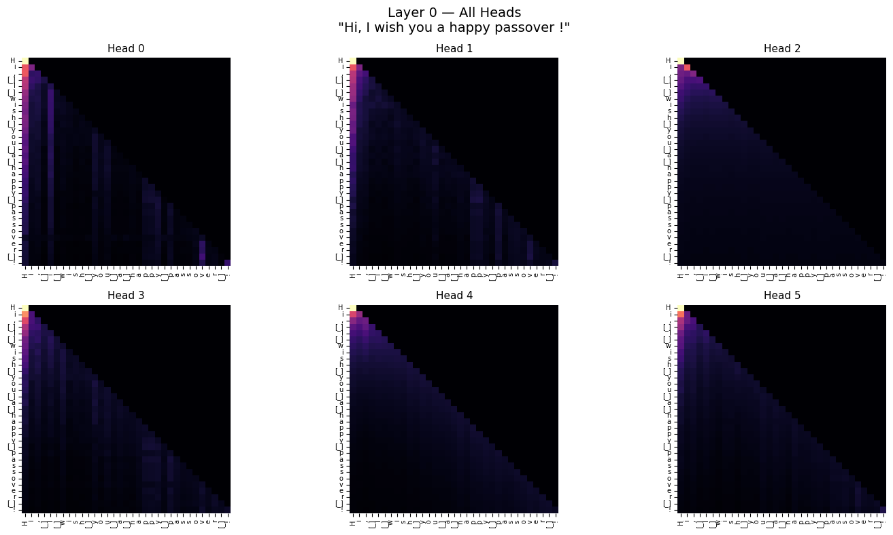
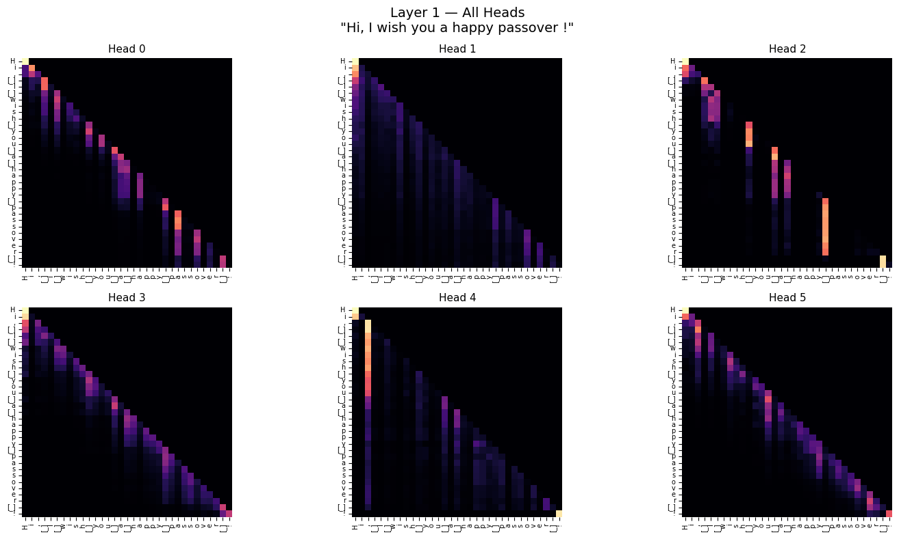
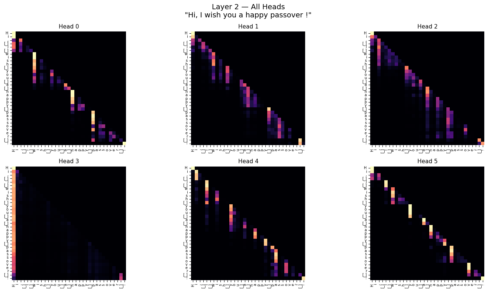
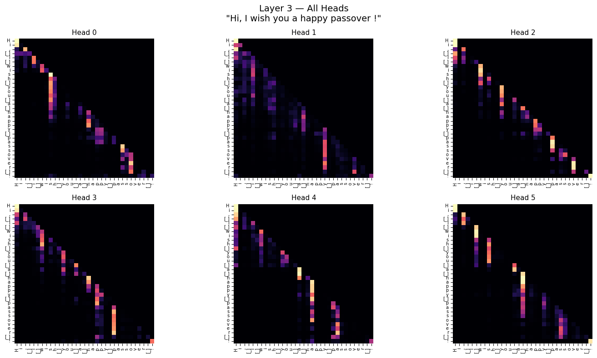
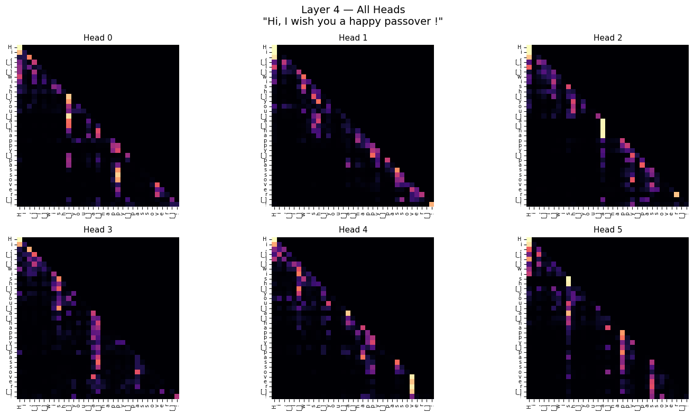
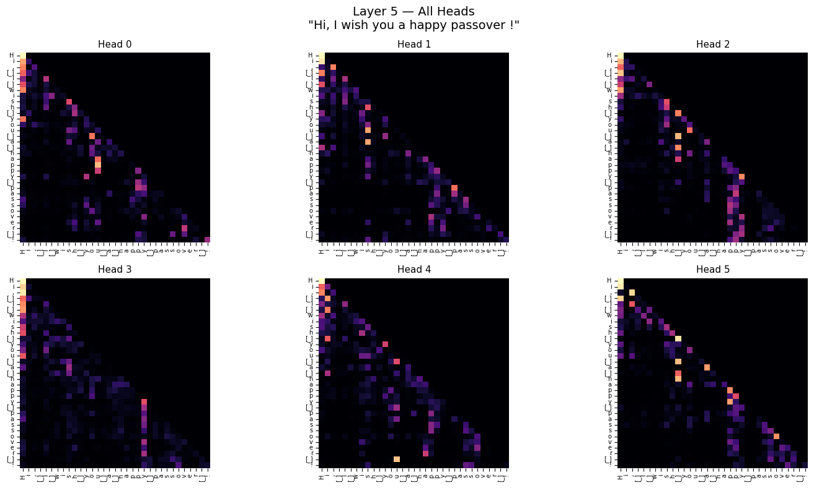

# Transformer Language Model — Project Report

---

## 1. Shakespeare Results

We trained a character-level Transformer on the Shakespeare dataset using the default sequence length of 128. We did this in two parts: first we ran it for 10,000 batches, and then we loaded the saved model and trained it for another 10,000 batches.

| Metric | Value |
|--------|-------|
| **Best loss achieved** | **~0.293** |
| **Number of training updates** | **~20,000 batches** |
| **Number of training sequences** | **~8,714** (1.1 MB corpus ÷ 128 seq_len) |
| **Number of network parameters** | **2.72M** |

**Sample generated text at best loss (around batch 10,500):**

> w, my lords, castle, come.
> All Pardis thee, or about to me the sum.
> Now, brother, if my weak one thing indeed thy state,
> My doublet's grave be with more me,--as if
> they did not recoging with a respect woll give.
>
> PETRUCHIO:
> Well-disposed than 'more;' if you will live
> Here well accuse you in all.

The text looks pretty good. The model learned how to write like Shakespeare, including using character names in capital letters, new lines, and old English words. This shows that the low loss actually means the model is working well.

---

## 2. Hyperparameters

Here are the hyperparameters we used to get this loss:

| Parameter | Value |
|-----------|-------|
| Number of layers | 6 |
| Embedding dimension | 192 |
| Number of attention heads | 6 |
| MLP hidden size | 768 (= 4 × embed_size) |
| Sequence length | 128 |
| Batch size | 64 |
| Learning rate | 0.0005 |
| Optimizer | AdamW (β₁=0.9, β₂=0.95) |
| Gradient clipping | 1.0 |
| Dropout | None |
| Residual connections | Yes (`with_residuals=True`) |

These are the default parameters from the assignment instructions. We kept most of them the same and only changed a few things to see what would happen (explained below).

---

## 3. What We Tried

### 3.1 Residual Connections

We tried training models with and without residual connections (`with_residuals=True` and `False`).

- **Without residuals:** The loss went down very slowly, and the text it generated didn't make much sense.
- **With residuals:** The training was much faster and more stable, and the final loss was much better.

**Conclusion:** Residual connections are really important for this network and help a lot.

### 3.2 Optimizer (AdamW vs Adam)

We also compared the Adam optimizer with the AdamW optimizer.

- **Adam:** It started learning a bit faster at the very beginning but became unstable later.
- **AdamW:** It was much more stable and gave better results over long runs.

**Conclusion:** AdamW is better for this project.

### 3.3 Learning Rate

- **Bigger learning rate (0.001):** The loss dropped fast at first, but then it got stuck and unstable after a few thousand batches.
- **Default (0.0005):** This worked smoothly the whole time.
- **Smaller learning rate (0.0001):** This was just too slow, and it didn't get a good loss in the time I had.

**Conclusion:** The default learning rate of 0.0005 was the best choice.

---

## 4. Hebrew Results

We also trained the model on the Hebrew dataset. We used exactly the same hyperparameters as the English dataset (10,000 batches, sequence length of 128).

| Metric | Value |
|--------|-------|
| **Best loss achieved** | **~0.195** |
| **Number of training updates** | **10,000 batches** |

**What We noticed on the Hebrew Dataset:**

1. **Better Loss:** The Hebrew model reached a much lower loss (~0.195) than the English one, and the loss between the batches was more unstable than the English one . We think this is because the dataset is smaller, so the network just memorized a lot of the text instead of generalizing.
2. **Memorizing repeating text:** The model perfectly memorized the legal notes and repeating footers at the end of the texts from "Project Ben-Yehuda". For example, it often generated this exact phrase: *"לתוכן הענינים לדף הראשי של פרויקט בן-יהודה דף זה הוא חלק מפרויקט בן-יהודה, שמתקיים הודות לסיוע של מתנדבים."*
3. **General Quality:** When it wasn't just repeating footers, the model did a good job learning Hebrew punctuation and spaces. The right-to-left language wasn't a problem for the Transformer because it just treats everything as a list of characters anyway.

**Sample generated text (batch 9900):**

> m ואין מצר – והד,
>
> פני, הצלורי, והדיה!
>
> מה-לכו – ומלמת!
>
> הוי, מספר סלים,
>
> פני שבל, אהל ממה רב כחל!
>
> ובהשמים הרים .
>
> לתוכן הענינים .
>
> לדף הראשי של פרויקט בן-יהודה .
>
> דף זה הוא חלק מפרויקט בן-יהודה, שמתקיים הודות לסיוע של מתנדבים.

---

## 5. Attention Analysis (Part 5)

### 5.1 How We did it

To see what the model is paying attention to, we added a simple trick inside `attention.py`. We created a dictionary called `ATTENTION_CACHE` that saves the attention matrices every time the `self_attention` function runs. We did this without changing the function inputs or outputs.

For a text of length N, the network has 6 layers and 6 heads. That means we get $6 \times 6 = 36$ matrices of size $N \times N$ for every input.

Then we wrote a short script called `analyze_attention.py` to:
1. Load our trained model.
2. Give it a short text to read.
3. Save all the attention matrices in a list.
4. Draw them as heatmaps using matplotlib.
5. Create a picture that shows all 6 heads of a single layer side by side.

The text we used for our tests was:
> *"Hi, I wish you a happy passover!"*

---

### 5.2 What I found

#### Layer 0 — Very basic behavior

In Layer 0, the heads don't really do much yet. The maps are mostly dark, with just a bright spot on the first character ("H"). This means the model is just looking at the start of the text and not checking the context yet.

---

#### Layer 1

Layer 1 is much more interesting. Almost all the heads have a bright diagonal line right under the main diagonal. This means:

> **Every character is looking strongly at the character right before it.**

This makes a lot of sense for a character-level model. The letter that came right before is usually the best hint to guess the next letter.

Also, in Heads 2 and 4, we can see bright vertical lines exactly where the space character is. This looks like the model is learning to find where words end. Head 2 also focuses on the "!" at the end.

---

#### Layer 2

In Head 3 of Layer 2, the very first column is always bright. This means the model always looks back at the first capital letter. This is probably a way to know it's the start of a sentence.

In Head 6 of Layer 2, the bright spots usually fall on the first letter after a space, which means it helps the model find word boundaries.

---

#### Layers 3 to 5 — Complicated patterns

**Layer 3:**

**Layer 4:**

**Layer 5:**

In the deeper layers, it's really hard to understand the heatmaps. The nice clean shapes from Layer 1 are gone, and it's just random bright spots. This happens because the deep layers are thinking about grammar or meaning, which we can't easily see on a simple graph.

---

### 5.3 Conclusion

Looking at the attention maps showed us exactly how a young model learns to read:
1. In the first layer, it just looks at the letter right before it (learning pairs of letters).
2. In the second layer, it starts finding spaces and capitals (learning words and sentences).
3. In the final layers, it does things that are too complicated to see easily.

---

## 6. Personal Experience

We really liked this project. Building a Transformer completely from scratch was very cool because it helped us understand how these new AI tools actually work behind the scenes. The math for self-attention is hard to understand in class, but writing the code for it and actually drawing the heatmaps made it super easy to see what it was doing.

It was also really fun to watch it start writing like Shakespeare and Hebrew after just a few batches. We were very surprised that it actually memorized the footers of the Hebrew website. Overall it was a great learning experience.
